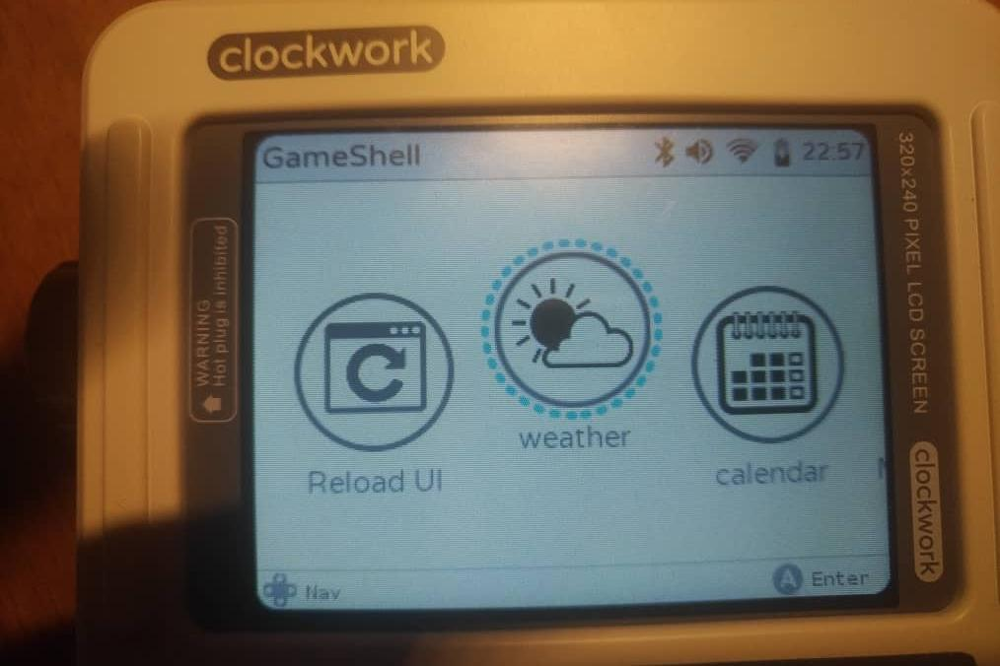
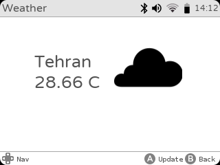

# cpiWeather
The simple Weather App for ClockWorkPI [GameShell launcher](https://github.com/clockworkpi/launcher)

# Running
Fist of all, you need the API key for to access openweathermap.

Follow these steps :

1. Replace your API key on the `config.json` file. ( in the `94_weather` folder )

2. Replace your location on the `config.json` file. ( in the `94_weather` folder )

3. On your GameSH copy `allsign.png` to `~/launcher/skin/default/sys.py/gameshell/icons`

4. On your GameSH copy `94_weather` to `~/launcher/Menu/GameShell/` (or `~/apps/Menu/60_Utils`, if you prefer)

5. Reboot GameSH or run `Reload UI` in `Launcher`

### Note 
* tested and worked with "Launcher" 1.25. 
* this app is not supported by [LauncherGo](https://github.com/clockworkpi/launchergo)

# Built with
[openweathermap API](https://openweathermap.org/current) Add your API to config.json

[The weather icons](http://www.mpetroff.net) These icons were created by Matthew Petroff 

[Python](https://www.python.org/) developed with Python 2.x (for compatibility with "Launcher")
